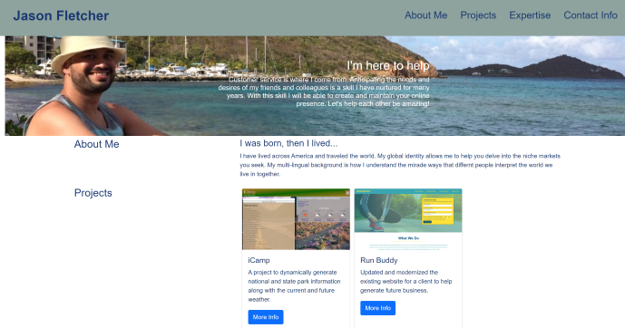

# Personal Portfolio
This is a page to showcase myself and some of the projects I have been working on.

## Table of contents
* [General info](#general-info)
* [Screenshots](#screenshots)
* [Technologies](#technologies)
* [Setup](#setup)
* [Features](#features)
* [Status](#status)
* [Inspiration](#inspiration)
* [Contact](#contact)

## General info
This portfolio page has a brief bio, links to current and past projects and some social media.

## Screenshots


## Technologies
* HTML5
* CSS3
* Bootstrap

## Setup
Visit: https://blueink38.github.io/new-portfolio/

## Code Examples
```
<div class="card-body">
    <h5 class="card-title">iCamp</h5>
        <p class="card-text">A project to dynamically generate national and state park information along with the current and future weather.</p>
        <!-- Button trigger modal -->
        <button type="button" class="btn btn-primary" data-bs-toggle="modal" data-bs-target="#icampModal">
        More Info
        </button>
```

## Features
* Autobiography
* Current projects
* Contact Links

<bold>To-do list:<bold>
* New Stylings
* Updating new projects

## Status
This project is forever in progress.  As my skills broaden and I tackle new projects I will update this portfolio.

## Inspiration
Inspired by me and my desire to grow!

## Contact
Created by [me](https://blueink38.github.io/new-portfolio/) - feel free to contact me!